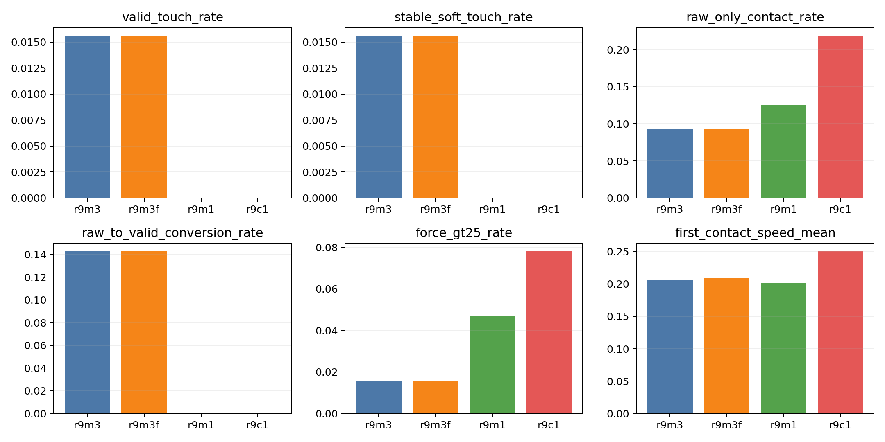
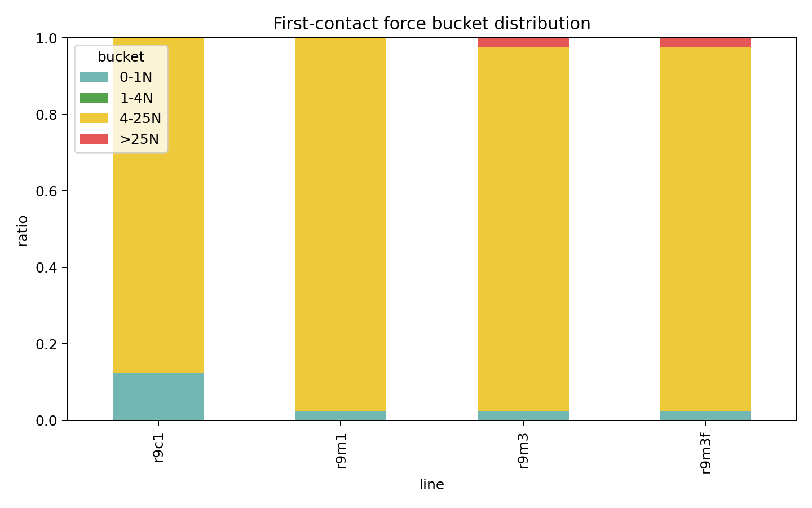
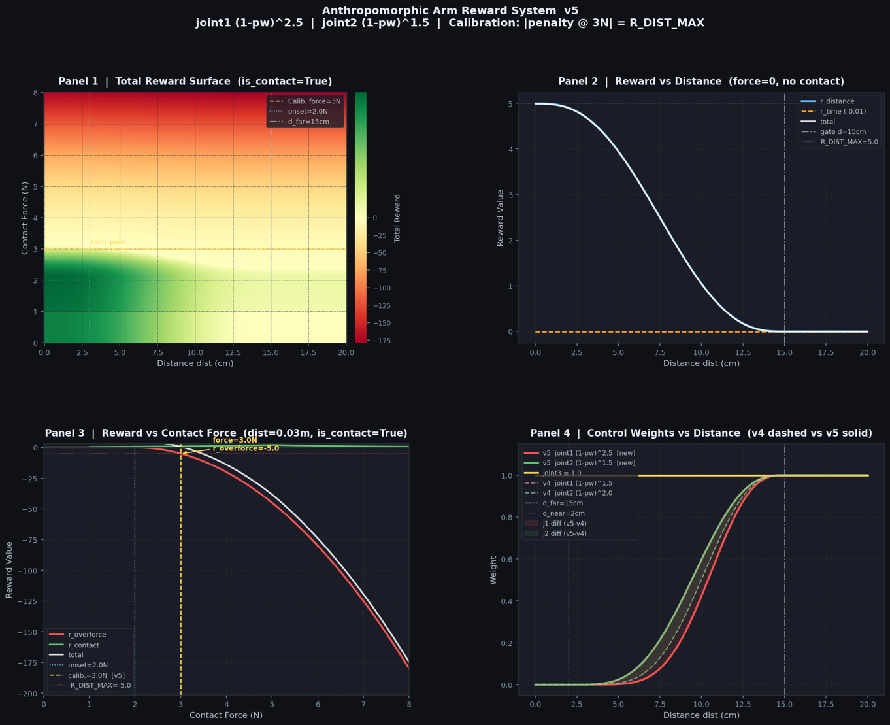

# Embodied Contact Generalization

This repository is a compact research showcase for an embodied AI project on task-general contact control.

The long-term goal is embodied model task generalization: a model should learn reusable contact and control representations, then transfer them across manipulation tasks. The current minimum validation task is simulation soft touch, because it exposes whether a controller can distinguish loose contact, unsafe contact, valid touch, and stable low-force contact under strict metrics.

This repository is intentionally small. It shows a developing project through its problem definition, diagnostic metrics, reward-design artifacts, and one runnable evidence-loop demo. Raw experiment archives, internal audit notes, checkpoints, traces, cache files, and platform logs are excluded.

## Research Direction

Traditional robot control often separates perception, state estimation, policy learning, action mapping, and motor execution into a specialized chain. This project explores a full token control loop:

```text
sensor / observation tokens
+ latent state z(t) tokens
+ goal and context tokens
        |
        v
DreamerV3-style world model
        |
        v
imagined rollouts and contact dynamics representation
        |
        v
Emu3.5-style next-action-token prediction
        |
        v
safety wrapper and motor execution
```

The key hypothesis is that the DreamerV3 RSSM latent state `z(t)` should directly condition action-token prediction. This connects learned physical dynamics with action generation inside one loop.

Emu3.5-style modeling appears in two roles:

- high-level meta-optimization over task context, diagnostics, and rollout evidence;
- low-level next-action-token prediction conditioned on observation tokens, goal tokens, and `z(t)`.

DreamerV3 provides the world-model engine and imagined rollouts. A safety wrapper remains necessary for force limits, velocity limits, action clipping, and stop behavior.

## Why Soft Touch

Soft touch is a small task with a hard boundary. A policy can touch an object while still failing the actual requirement of gentle, stable, low-force contact. That makes it useful for testing embodied generalization under physical constraints.

The evidence loop tracks:

- `touch_rate`, `valid_touch_rate`, and `stable_soft_touch_rate`;
- `over_force_rate`, first-contact force, and first-contact speed;
- failure types such as hard impact, raw-contact-only behavior, contact flicker, early release, and near-surface mismatch.

## Diagnostic Figures

The figures below are lightweight public artifacts from sandbox development. Historical branch or version labels should be read as anonymized experimental conditions rather than product names.



The metric comparison shows why loose contact is insufficient as evidence: valid and stable soft-touch rates remain sparse, while raw-contact-only behavior, force tails, and first-contact speed expose the real blockers.



The force distribution supports the same evidence boundary. It helps separate gentle-contact candidates from hard-impact behavior, but it does not establish a solved controller.



The reward surface records one reward-shaping pass for the anthropomorphic-arm soft-touch task. It shows how distance shaping, contact-force penalties, calibration around 3N, and distance-dependent control weights were inspected before running broader policies. This is design evidence for the evaluation loop, not a claim that the controller has solved soft touch.

## Run Demo

```bash
cd soft_touch_evidence_loop_demo
python3 run_demo.py sample_metrics.json demo_report.md
```

The demo reads synthetic redacted sample metrics and writes a Markdown report. It does not train a policy, run MuJoCo, call a model API, or launch GPU jobs.

## Files

- `README.md`: project summary and claim boundary.
- `figures/`: diagnostic plots and reward-design figures from sandbox development.
- `soft_touch_evidence_loop_demo/`: runnable metric-classification demo.
- `LICENSE_OR_ACCESS_NOTE.md`: access and reuse boundary.

## Claim Boundary

The current project state is research-in-progress:

- soft-touch success is not claimed;
- direct Emu3.5 motor control is not claimed;
- the DreamerV3 + Emu3.5 closed-loop system is an architecture direction, not a completed deployment;
- current evidence should be read as sandbox-level diagnostic signal.

The useful signal in this repository is the development pattern: define a difficult physical behavior precisely, build an inspectable evaluation loop, keep failure categories honest, and use the minimum task to guide a broader embodied-model architecture.
